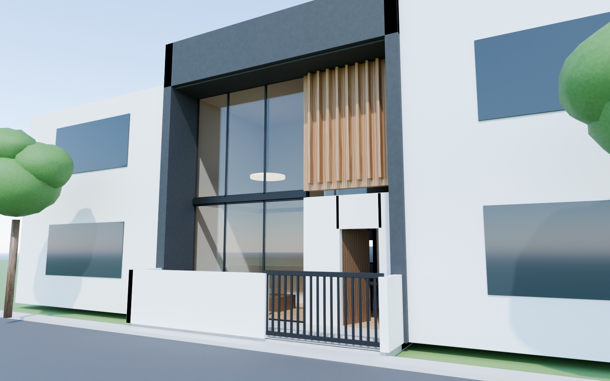

# PaidaHome

Concept design for a modern G+1 duplex on a 20 ft × 40 ft (800 sq ft) south-facing plot.

**Live site:** https://smohantty.github.io/PaidaHome/ (the interactive 3D model) · [renders](https://smohantty.github.io/PaidaHome/renders.html) · [floor plans](https://smohantty.github.io/PaidaHome/plans.html)



- **`index.html`**: interactive 3D model built with three.js. Orbit the house, view each floor with walls cut away, tap a room for its size and notes, separate the floors with the explode slider, and follow the sun path through the day and seasons (latitude about 13° N).
- **`plans.html`**: 2D floor plans, a room schedule, a vastu check, and assumptions.
- **`renders.html`**: photoreal Cycles renders: street, living room, gallery, dusk and aerial.
- **`blender/render_house.py`**: builds the same house in Blender with materials, sky, sun and lights, then renders the views.

## Re-rendering

```sh
# full quality (about 10 min on an M1 GPU)
/Applications/Blender.app/Contents/MacOS/Blender -b -P blender/render_house.py -- --out renders --samples 128 --res 1600x1000
# quick test of one view
/Applications/Blender.app/Contents/MacOS/Blender -b -P blender/render_house.py -- --out /tmp/test --samples 24 --res 800x500 --views front
# save an editable .blend without rendering
/Applications/Blender.app/Contents/MacOS/Blender -b -P blender/render_house.py -- --blend duplex.blend --views none
# convert to JPG for the site
for f in renders/*.png; do sips -s format jpeg -s formatOptions 85 "$f" --out "${f%.png}.jpg"; done
```

Views: `front`, `aerial`, `living`, `gallery`, `dusk`. The script uses the Metal GPU when it's available and falls back to CPU.

The HTML pages open directly in a browser; there's no build step. The 3D model loads three.js from jsDelivr, so it needs an internet connection.

## Design summary

| Floor | Spaces |
|---|---|
| Ground | Porch, double-height living + dining, dog-leg stair, kitchen (NW), Bedroom 1 + attached Bath 1 |
| First | Gallery lounge over the living room, Bedroom 2 + attached Bath 2 (stacked over Bath 1), study / flex room |
| Terrace | Stair room with water tank, pergola deck, solar roof, front concrete frame |

- Living room ceiling: about 19′6″ (double height)
- Enclosed floor area: about 1,170 sq ft (the void isn't counted)
- Floor-to-floor height: 10′

## Assumptions to confirm

- The road is on the 20′ south side.
- Setbacks: 3′ front, 2′ rear, no side setbacks. Check these against local bylaws for ground coverage and FAR.
- There's no car parking. It would need a stilt floor.
